# 💻 Atelier de découverte : 
Deviens un As de l'informatique avec ton 
Raspberry Pi !

| **Titre** | Atelier de découverte du métier d'informaticien |
| --- | --- |
| **Durée** | ½ journée (environ 3h30) |

**Objectifs :**

Découvrir les bases du métier d'informaticien
   - installation de système
   - programmation
   - mise en réseau avec des Phidgets|
---

## 🚀 Prêts à embarquer dans le monde des informaticiens ?

Bienvenue dans cet atelier où tu apprendras à utiliser un mini-ordinateur, le Raspberry Pi, afin de faire des trucs vraiment cool ! Avec quelques manipulations, tu pourras programmer et mettre en place un jeu vidéo !

---

## 💻 Matériels nécessaires

|Ecran |Clavier / Souris |Raspberry Pi (mini ordinateur) |
|----|----|----|
|  |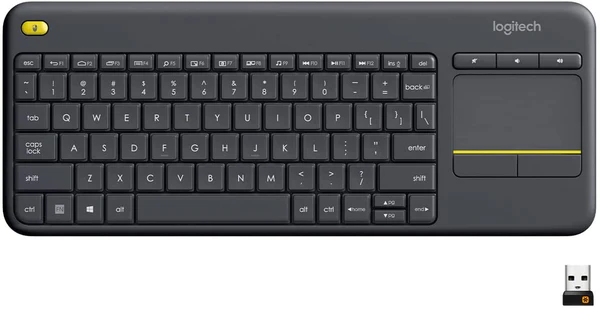 |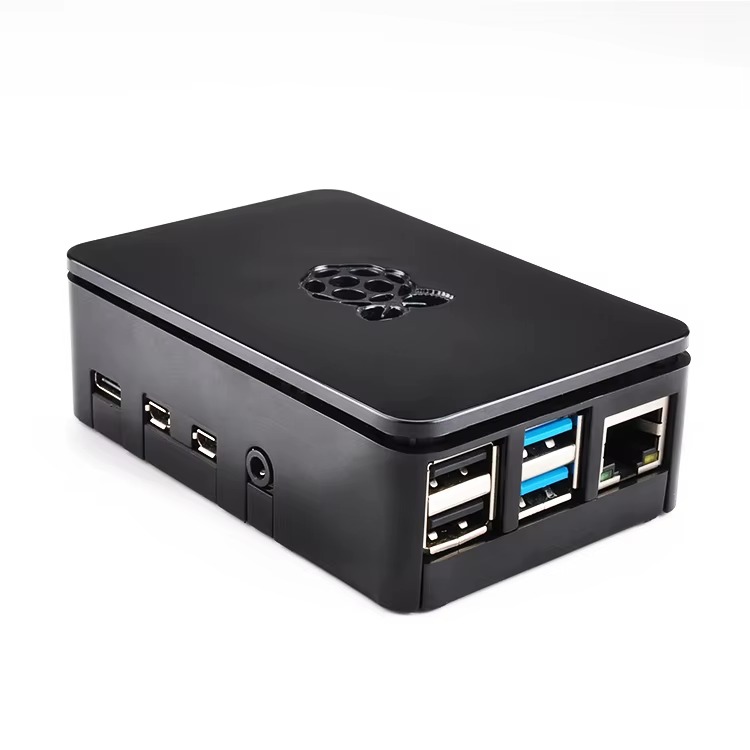 |

|Alimentation Raspberry Pi |Switch (pour connecter plusieurs ordinateurs ensemble) |3x Câbles réseaux (blanc, bleu, violet)  |
|----|----|----|
|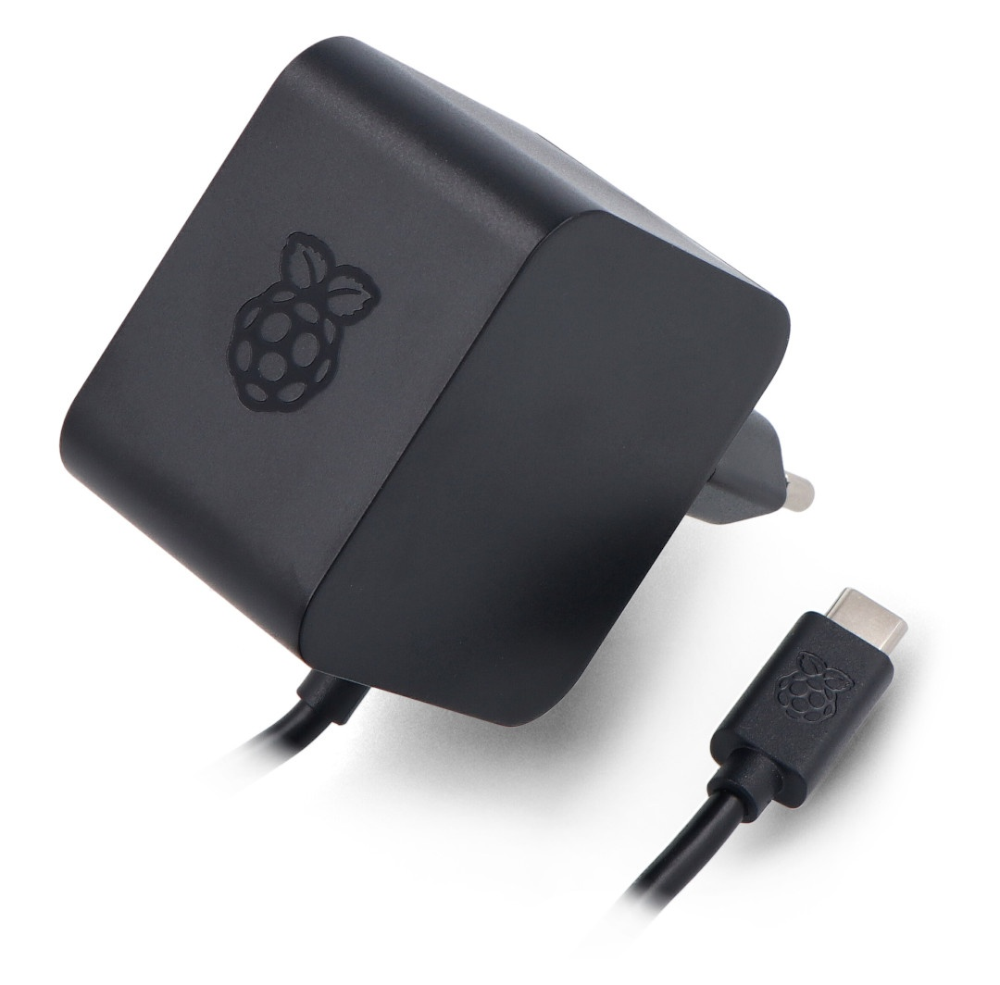 |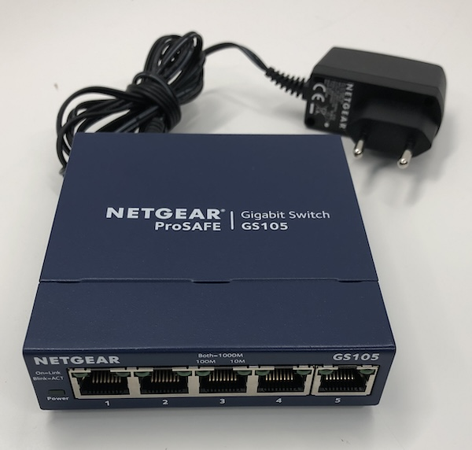 |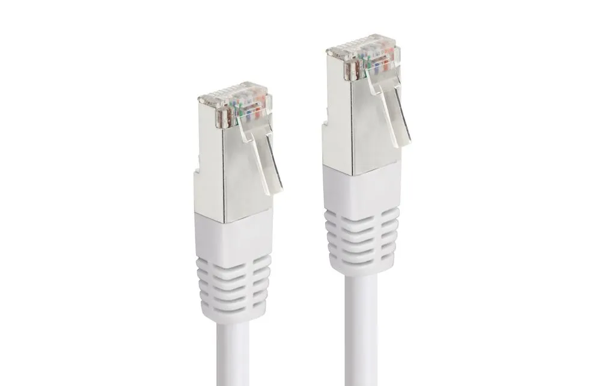 |

|Câble pour Phidget |Phidget Hub (HUB0000_0) |Adaptateur SD vers USB |
|----|----|----|
|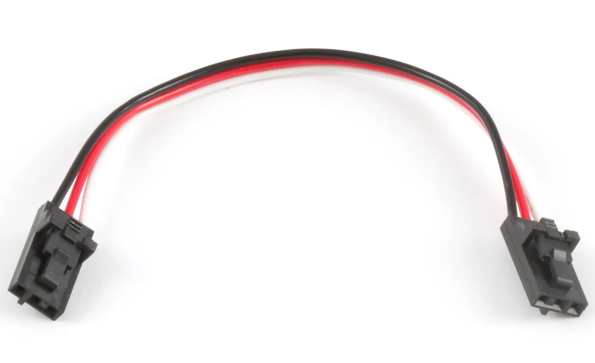 | |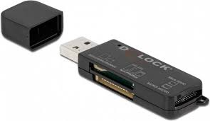 |

|Câble Phidget HUB |Carte micro SD (stockage) |Câble HDMI (vidéo) |
|----|----|----|
|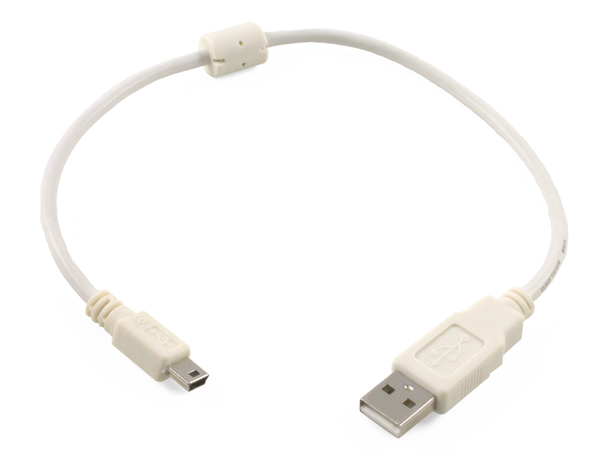 |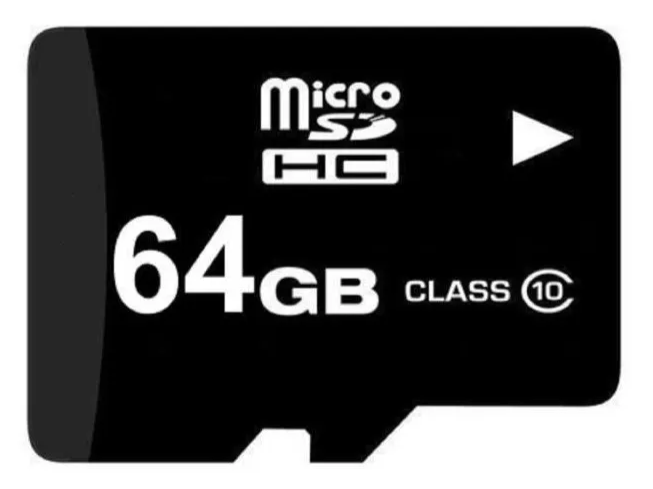 |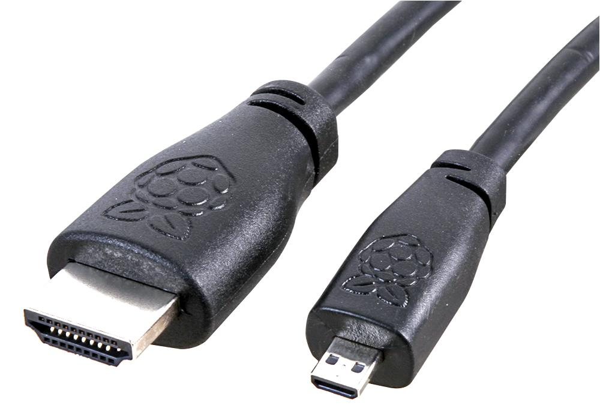 |

|Phidget thumbstick (joystick) |Phidget son |Phidget lumière |
|----|----|----|
| | | |

|Phidget slider |Phidget distance |Phidget température |
|----|----|----|
| | | |

---

## 🛀 Les étapes de l’aventure

### 1. Préparation de la carte SD

La première étape de votre travail consiste à préparer une carte SD pour accueillir le système d’exploitation Raspberry Pi OS.

Le système d'exploitation est le programme principal qui fait fonctionner un ordinateur. Il gère les composants à l'intérieur, comme les applications, les fichiers et les composants matériels (écran, clavier, etc.), dans le but que tout fonctionne correctement ensemble.

**Objectif :**

- Préparer une carte SD avec un système d’exploitation linux.

**Réalisation :**

- Insère la carte SD dans son adaptateur et branche l’adaptateur sur l’un des ports USB de ton poste de travail.


- Dans la barre de recherche Windows, recherche l’application “Raspberry Pi Imager” et démarre-la.


- Une fois l’application lancée, tu vas réaliser plusieurs étapes afin de préparer la carte SD qui servira d’espace de stockage principal pour ton Raspberry Pi.
- Premièrement, sélectionne le modèle du Raspberry. Dans notre cas, il s’agit d’un Raspberry Pi 4


- Puis, sélectionne ensuite le système d’exploitation Raspberry PI OS (64-BIT)


- Sélectionne le support de stockage (carte SD)
- Passe à l’étape suivante, refuse les réglages de personnalisation de l’OS si cela est demandé et accepte de supprimer les données déjà présentes sur la carte.
- L’écriture de la carte commence normalement automatiquement.
- L’écriture peut prendre quelques minutes. En attendant que la carte soit prête, tu peux déjà débuter l’étape suivante.

---

### 2. Préparation et branchement du matériel

Cette seconde étape te permet d’alimenter, connecter et rendre utilisable les différents appareils qui sont mis à ta disposition.

**Objectifs :** 

- Reconnaître les différents appareils et câbles
- Comprendre l'importance du réseau dans l'informatique.

**Préparation du switch :**

- Branche l'alimentation à l’arrière du switch.


- Branche l'alimentation dans une prise courant


- Branche un câble réseau entre le port n°1 du switch et la prise réseau mise à ta disposition (EMFNet).


**Préparation du Raspberry Pi :**

- Branche le périphérique USB (clavier, souris) avec le dongle USB.


- Branche-le également à un écran à l’aide du câble HDMI.


- Vérifie que l’écriture et la vérification de la carte SD que tu as préparée soient bien terminées puis, insère la  carte dans le port prévu à cet effet sous l’appareil.


- Finalement, branche l’alimentation du Raspberry.


---

### 3. Configuration initiale du Raspberry Pi

Maintenant, découvre comment se déroule la configuration initiale d’un système d’exploitation linux. C’est une étape importante lorsque tu prépares une nouvelle station de travail.

**Objectif :** 

- Apprendre à réaliser la configuration initiale d’un OS.

**Réalisation :**

- Une fois le Raspberry Pi connecté à son alimentation, il démarre automatiquement, il n’y a pas de bouton d’allumage.


- Les premiers paramètres à configurer lors du premier lancement d’un système d’exploitation sont généralement la langue, le clavier et le fuseau horaire. Tu parcours les différentes possibilités et tu sélectionnes les paramètres adéquats suivants  :
    - Country : Switzerland
    - Language : Swiss French
    - Timezone : Zurich
    
    Désélectionne les deux options désignées ci-dessous.
    

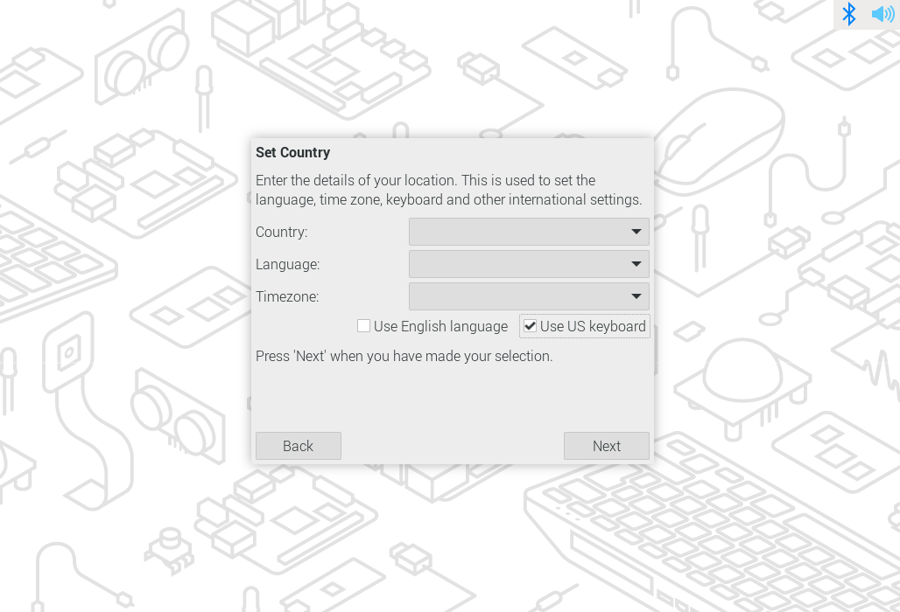

- Maintenant, tu crées un nouvel utilisateur. Il faut choisir un nom et un mot de passe. Pour cet exercice, tu nommes ton utilisateur `stage` et son mot de passe est `Pa$$w0rd`. Tu saisis le nom dans le premier champ et tu saisis le même mot de passe dans les deux derniers champs de texte.

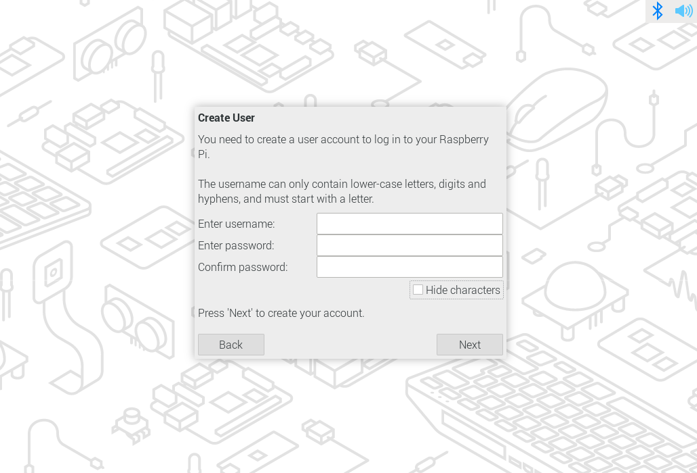

- L’étape suivante consiste à configurer le réseau sans fil. Pour l’instant, tu l’ignores et tu reviendras plus tard au moyen d’une autre méthode de connexion à internet.


- L’avant dernière étape de cette installation concerne les mises à jour. Pour des raisons de sécurité, il est primordial de garder un système d’exploitation à jour. Comme cette étape prend du temps, tu passes cette étape en appuyant sur “skip”.


- Tu a atteint la fin de cette configuration de base, tu redémarres l’appareil afin que les paramètres choisis s’appliquent correctement.


---

### 4. Connexion à Internet

Tu vas maintenant lier les deux appareils que nous avons préparés précédemment afin de connecter ton Raspberry Pi à internet et qu’il puisse communiquer avec le reste du monde.

Afin de bien comprendre l’importance de cette étape, tu réaliseras divers tests avant et après la connexion.

**Objectif :**

- Comprendre l'importance du réseau dans l'informatique.

**Réalisation :**

- Tu vérifies d'abord l’accès à Internet. Comme tu n’as rien configuré, il est normal que cela ne fonctionne pas.
    - Pour tester, ouvre le navigateur et effectue une recherche sur `www.google.com`.
    - Tu peux aussi ouvrir l’invité de commande linux et exécuter une commande de test ping comme ci-dessous. Il suffit de recopier la commande et de l’exécuter en appuyant sur la touche [Enter].
    
    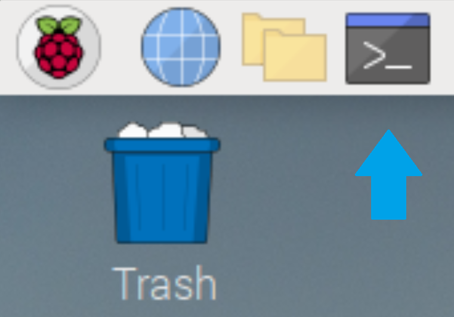
    
    ```bash
    ping google.com
    ```
    
    Pour arrêter la commande, il te suffit d’appuyer simultanément sur les touches CTRL + C de ton clavier.
    
    Cette commande teste si ton ordinateur peut communiquer avec le site de Google. Elle envoie des messages (paquet réseau) pour vérifier la connexion. En retour, elle t’affiche si Google répond ainsi que le temps que ça prend.
    
- Tu lies maintenant le Raspberry Pi à l’équipement réseau. Adresse-toi au professeur présent dans la salle pour récupérer un deuxième câble réseau. Ensuite, tu le branches sur le port n°2 du switch et l’unique port réseau du Raspberry Pi.

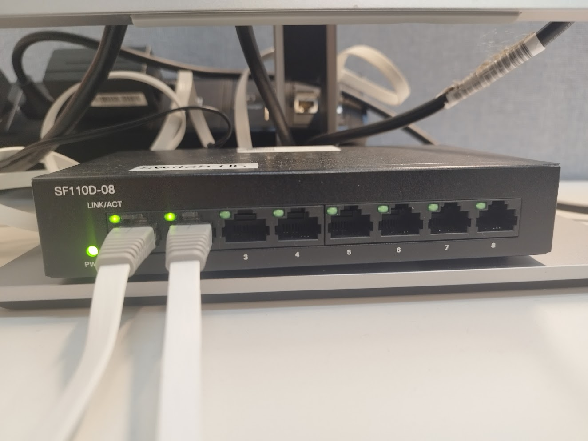

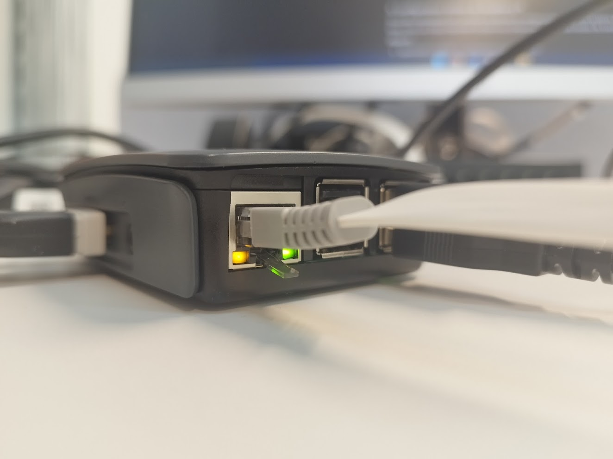

- Maintenant, tu vérifies à nouveau la connexion avec les deux méthodes mentionnées précédemment. La connexion à Internet est établie, les tests doivent se passer sans problème.

---

### 5. Code ton Jeu du “snake” avec ta propre manette


Nous allons, ensemble, réaliser les quelques actions pour jouer au jeu snake.

Le jeu est simple. Tu diriges un serpent qui se déplace dans un environnement en deux dimensions de manière verticale et horizontale.

Le but du serpent est de manger des pommes qui apparaissent aléatoirement sur ton écran. A chaque fois que le serpent mange une pomme, il grandit. Le jeu est infini mais, attention, il doit éviter les bords ou toi-même sinon tu perds la partie.


Tu finalises ton installation afin de faire fonctionner le jeu correctement. Tu retrouves, ci-dessous, un schéma vulgarisé de ce que tu dois mettre en place et du rôle de chacun des appareils.

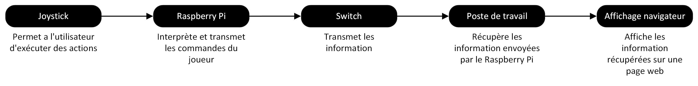

### 5.1. Préparation de la manette (sur le Raspberry Pi)

Tu as besoin d’une manette pour jouer.

- Ouvre le terminal de commandes linux


- Exécute les commandes suivantes une à une.
    - Téléchargement
        
        ```bash
        wget -P ~ https://raw.githubusercontent.com/emf-info/StageDecouverte/refs/heads/main/server_setup.sh
        ```
        
    - Modification des permissions
        
        ```bash
        chmod +x ~/server_setup.sh
        ```
        
    - Exécution
    
    Après avoir exécuté la commande suivante, tu entres le mot de passe défini durant la configuration du Raspberry Pi et tu valides avec la touche [Enter] 
    **Pour des raisons de sécurité,** il est normal que les caractères ne s’affichent pas lorsque tu écris le mot de passe.
    
    ```bash
    sudo ~/server_setup.sh
    ```
    

Tu as téléchargé, rendu exécutable et exécuté un script linux. Ce dernier contient une liste de commandes et d’actions à exécuter automatiquement.

Ce genre de script est utilisé pour gagner du temps lors de tâches répétitives, d’installations complexes ou pour de l’automatisation.

Dans notre cas, il met en place les différents systèmes qui permettront de jouer à snake !

### 6. Code par toi-même ! (A faire sur l'ordinateur)

**Objectif :**

Apprendre à créer un programme simple en blocs pour utiliser différents Phidgets.

**Réalisation :**

1. Connecte les Phidgets au HUB à l’aide des câbles fournis.
2. Branche le Hub au Raspberry Pi à l’aide du câble USB.
3. Ouvre le site [makecode.phidgets.com](https://makecode.phidgets.com/#).

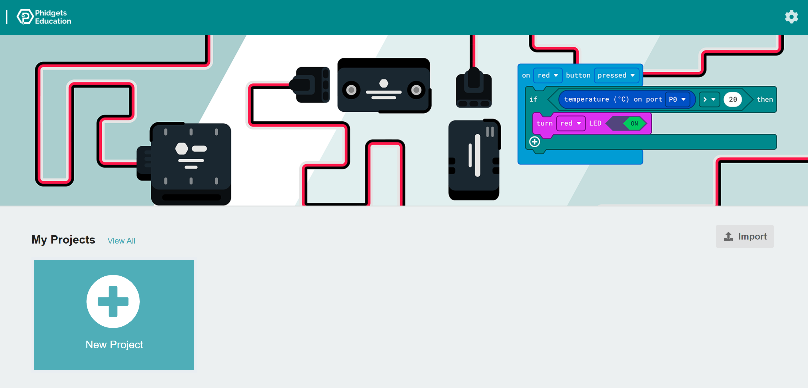

1. Clique sur "Nouveau projet".
2. Tu arrives ensuite sur la page suivante :

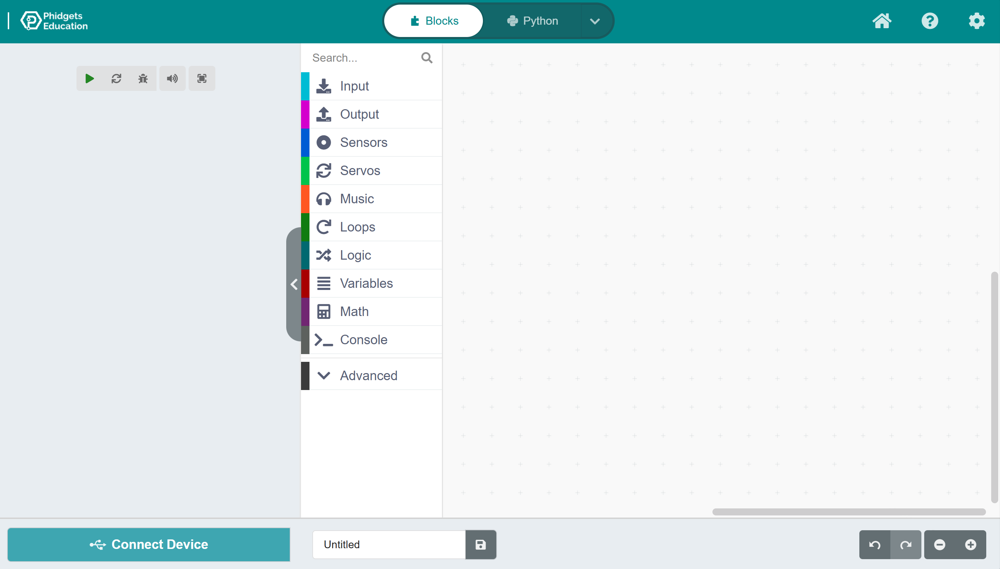

Ce programme permet de prendre en main les Phidgets et la création de petits programmes simples.

Clique sur le bouton en bas à gauche pour connecter les Phidgets

Tu peux t’amuser à composer toi-même ton programme.

Des blocs d’action sont à disposition dans le menu sur la gauche. Pour les utiliser, tu les glisses et les places sur la droite. Ces blocs remplacent les lignes de code. Ils permettent de découvrir l’univers du développement de façon ludique et instinctive.

Pour te faire une idée, visualise la vidéo d’exemple. On réalise un programme qui affiche la température actuelle mais uniquement si le slider est à 100%.

[🎞️ Vidéo pour un exercice d'exemple](https://github.com/emf-info/StageDecouverte/raw/refs/heads/main/consigne_ressources/ex_phidget.mp4)

Tu as découvert comment cela fonctionne. Si tu te sens à l’aise, tu essayes de créer toi-même un programme. Tu as également d’autres Phidgets à disposition pour t’amuser et inventer… A toi de jouer !


### 6.2. Mise en place de l’affichage

Maintenant, ta manette est prête. Tu prépares l’affichage de ton jeu depuis ton poste de travail. Tu as besoin de quelques fichiers et tu fais les ajustements suivants.

- Télécharge les fichiers qui permettent d’afficher ton jeu [ici](https://github.com/emf-info/StageDecouverte/raw/refs/heads/main/Stage%20d%C3%A9couverte.zip).
- Clique avec le bouton droit de la souris sur le fichier téléchargé et sélectionne la fonctionnalité  “Extraire tout”. Il s’agit d’un fichier compressé.
- Tu as, dès lors, accès à un dossier contenant les fichiers utiles pour l’affichage de ton jeu.

- En parcourant le contenu du dossier, tu remarques trois fichiers.
    - Le premier fichier s’appelle “index.html”. Il sert à définir le contenu de notre affichage qui peut être du texte, un tableau, une liste, etc.
    - Le second fichier “styles.css” définit comment sera affiché le contenu. Il décrit, par exemple, la couleur du texte ou du fond.
    - Finalement, tu retrouves le fichier nommé “script.js”. Ce fichier contient toutes les actions techniques de notre affichage.

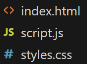

- Pour visualiser, tu double cliques sur le fichier “index.html”. Une page Internet doit s'ouvrir.

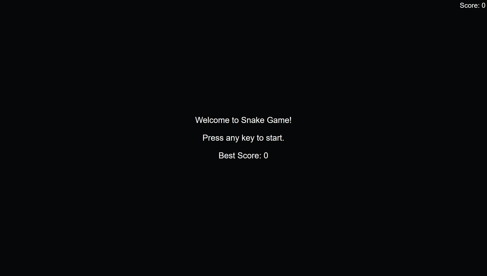

- Tu constates que, pour l’instant, le jeu n’est pas fonctionnel. Comme mentionné précédemment, l’affichage doit communiquer avec notre manette pour que le jeu fonctionne.  Tu dois modifier le code fournit en tenant compte des informations trouvées.

### 6.3. Rendre ton jeu fonctionnel

Dans le point précédent, nous avons mentionné les différents fichiers utiles pour l’affichage. Un de ces fichiers est utilisé pour la communication avec la manette. Tu as peut-être deviné, il s'agit du fichier “script.js” ! 

Mais avant de modifier le code, il faut d’abord savoir ce qu’on va faire. Pour trouver la manette, on doit savoir comment s’y adresser.

Les ordinateurs sont tous associés à une adresse IP sur un réseau. Cette adresse  permet de communiquer sur le réseau (comme le prénom de quelqu’un pour s’adresser à la personne). C’est cette adresse IP que nous utiliserons pour récupérer les commandes de notre manette.

Pour trouver l’adresse IP de notre Raspberry Pi, ouvre un nouveau terminal et tape la commande suivante :

```bash
ip addr show
```

Tu dois obtenir un résultat comme celui-ci :

```bash
1: lo: <LOOPBACK,UP,LOWER_UP> mtu 65536 qdisc noqueue state UNKNOWN group default qlen 1000
    link/loopback 00:00:00:00:00:00 brd 00:00:00:00:00:00
    inet 127.0.0.1/8 scope host lo
       valid_lft forever preferred_lft forever
    inet6 ::1/128 scope host 
       valid_lft forever preferred_lft forever
2: eth0: <BROADCAST,MULTICAST,UP,LOWER_UP> mtu 1500 qdisc mq state UP group default qlen 1000
    link/ether 00:15:5d:24:f1:03 brd ff:ff:ff:ff:ff:ff
    inet **XXX.XXX.XXX.XXX**/YY brd XXX.XXX.XXX.XXX scope global dynamic noprefixroute eth0
       valid_lft 86210sec preferred_lft 86210sec
    inet6 fe80::a725:1f07:d8ed:8bda/64 scope link noprefixroute 
       valid_lft forever preferred_lft forever
```

Il y a beaucoup d’informations mais c’est la suite de numéros en rouge qui nous intéresse. Prends en note pour modifier le code.

Tu peux retourner sur ton poste de travail pour modifier l’affichage.

Fais un clic droit sur le fichier “script.js”, sélectionne “Ouvrir avec” et choisis un logiciel pour éditer le code comme Visual Studio Code ou simplement le bloc-note.

Tu recherches parmi ces lignes de code, celle qui permet de spécifier l’adresse IP.

Voilà à quoi cela ressemble :

```jsx
fetch ('http://XXX.XXX.XXX.XXX:3000/api/joystick')
```

Tu remplaces l’adresse IP présente dans le code par celle de ton Raspberry Pi et tu enregistres tes modifications et tu fermes l’éditeur de texte.

Puis, retourne sur ton navigateur et recharge la page grâce à la touche “F5” sur ton clavier.

Bien joué, ton jeu Snake est maintenant opérationnel !


Si quelque chose ne fonctionne pas correctement ou que tu as des questions. N’hésite pas à t’adresser à l’accompagnant.

### 7. Challenges avec Scratch et Phidgets

Voici quelques challenges que tu peux effectuer avec les phidgets. On utilise le site scratch qui permet de créer des petits programmes simplement avec des bloques comme tu l’a fait durant l’exercice 5.

Ouvre scratch sur l’ordinateur à l’adresse suivante : [http://phidgets.com/education/scratch](http://phidgets.com/education/scratch)

Pour tous les challenges, tu aura besoins du HUB, du cable USB et des cables pour les phidgets. Les phidgets a utiliser sont précisés pour chaque exercice.

Pour te simplifier la tache, pour chaque challenge tu auras un fichier qui contiens la base de chaque programme. Pour utiliser cette base, tu dois la télécharger, puis l’importer dans scratch :

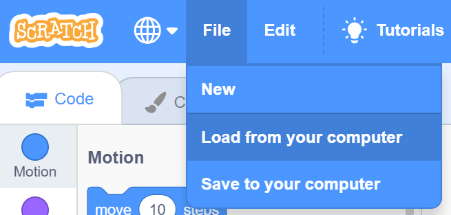

Et tu sélectionne le fichier que tu viens de télécharger.

Il te faut également importer les blocs de code des phidgets :


Et finalement, il y a deux boutons qui te permettent de lancer et de stoper le programme :


1. **Challenge 1 : Déplacement et Saut**
    
    Utilise le capteur **thumbstick** pour déplacer Scratch et effectuer un saut.
    
    
    
    Télécharge le programme suivant : 
    
    [Challenge_1.sb3](consigne_ressources/Challenge_1.sb3)
    
    Recopie le code suivant :
    
    
    
2. **Challenge 2 : Mouvements avec le joystick**
    
    Utilise le capteur **thumbstick** pour déplacer le poisson horizontalement et verticalement.
    
    
    
    Télécharge le programme suivant : 
    
    [Challenge_2.sb3](consigne_ressources/Challenge_2.sb3)
    
    Pas d’exemple de code pour cet exercice, essaie par toi-meme !
    
3. **Challenge 3 : Changement de taille avec le slider**
    
    Utilise le capteur **slider** pour modifier la taille de Scratch.
    
    
    
    Télécharge le programme suivant : 
    
    [Challenge_3.sb3](consigne_ressources/Challenge_3.sb3)
    
    Pas d’exemple de code pour cet exercice, essaie par toi-meme !
    
4. **Challenge 4 : Musique avec la distance**
    
    Utilise le capteur de **distance** pour jouer de la musique.
    
    
    
    Télécharge le programme suivant : 
    
    [Challenge_4.sb3](consigne_ressources/Challenge_4.sb3)
    
    Pas d’exemple de code pour cet exercice, essaie par toi-meme !
    
5. **Challenge 5 : Interaction avec le capteur sonore**
    
    Utilise le capteur **sound** pour modifier le fond en faisant du bruit.
    
    
    
    Télécharge le programme suivant : 
    
    [Challenge_5.sb3](consigne_ressources/Challenge_5.sb3)
    
    Pas d’exemple de code pour cet exercice, essaie par toi-meme !
    

---

## 🚀 Prêt à coder et explorer ?

L’informatique, c’est comme une aventure pleine de mystères ! En suivant ces étapes, tu vas découvrir ce qu’un informaticien fait au quotidien. Qui sait, peut-être que tu deviendras le prochain génie des systèmes ou un développeur star !

Alors, prêt à relever le défi ? 🎉
